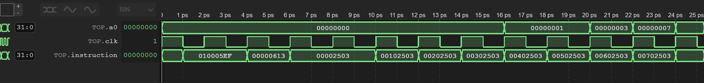
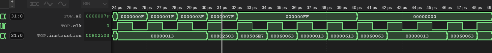
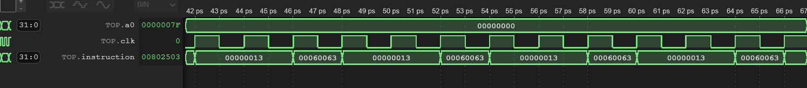
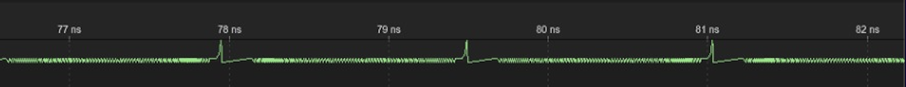
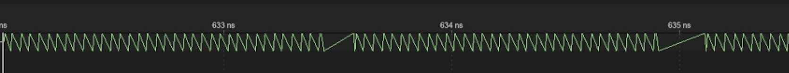
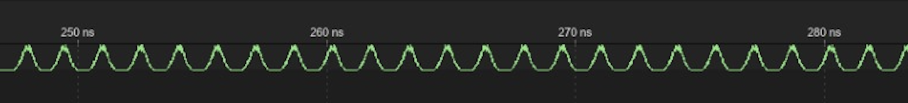
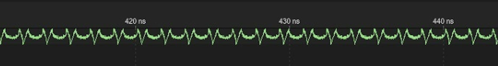

# Test Results & Proof of Success - Pipelined
This page displays the test programmes used to verify our design and the resultant outputs seen on the waveform viewer that proves the correctness of our CPU design implementation working as per the needs of this coursework.

In addition, we have also added videos that show the outputs for the F1 Program driving the neopixel bar on VBuddy and the trace values for the Reference Program plotted on the VBuddy's TFT display.

# F1 Program

The program developed and used by the team:
```
main:
	jal a1, iloop
    nop
    nop
    addi a2, zero, 0x0
    beq a2, zero, 0
    nop 
    nop
    
iloop:
	lw a0, 0(zero)
    lw a0, 1(zero)
    lw a0, 2(zero)
    lw a0, 3(zero)
    lw a0, 4(zero)
    lw a0, 5(zero)
    lw a0, 6(zero)
    lw a0, 7(zero)
    nop
    nop
    nop
    lw a0, 8(zero)
    jalr a3, a1, 0
    nop 
    nop
    
 mloop:
 	beq a2, zero, mloop
    nop
    nop
    
```
Resultant waveform view from the `risc_v.vcd` file:




Outputs from `a0` driving the neopixel bar on VBuddy:


https://user-images.githubusercontent.com/94545356/207894205-ea9e3988-8e03-4997-ae90-bb5cdb93f60d.mp4


# Reference Program

Resultant waveform view from the `risc_v.vcd` file:

### Sine ###

### Triangle ###

### Gaussian ###

### Noisy ###

